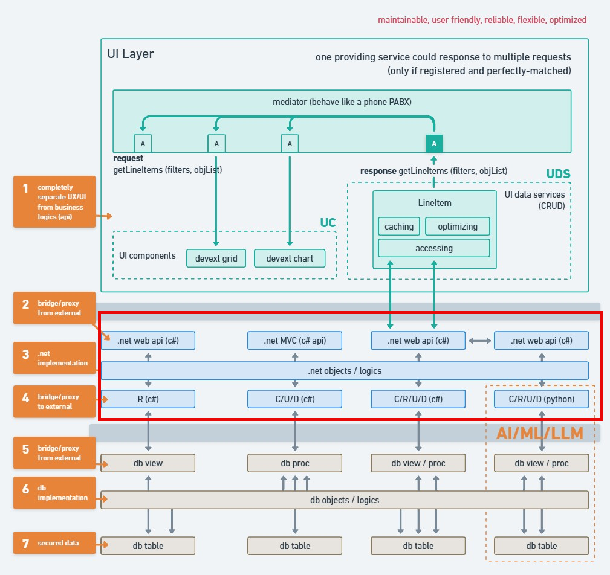

# LexiAuthenAPI 🌟



Welcome to **LexiAuthenAPI**! 🚀

**LexiAuthenAPI** is a powerful and scalable authentication and authorization API designed to manage users, roles, permissions, and related security features. Built with **ASP.NET Core** and **Entity Framework Core**, it provides robust and flexible authentication services suitable for a wide range of applications.

## Table of Contents

- [LexiAuthenAPI 🌟](#lexiauthenapi-)
  - [Table of Contents](#table-of-contents)
  - [Introduction](#introduction)
  - [Features](#features)
  - [Project Structure](#project-structure)
  - [Architecture](#architecture)
    - [Key Components](#key-components)
  - [Tech Stack](#tech-stack)
    - [Backend](#backend)
    - [Tools \& Libraries](#tools--libraries)
  - [Getting Started](#getting-started)
    - [Prerequisites](#prerequisites)
    - [Installation](#installation)
  - [Usage](#usage)
    - [Accessing Swagger UI](#accessing-swagger-ui)
    - [Authentication](#authentication)
  - [Contributing](#contributing)
    - [How to Contribute](#how-to-contribute)
    - [Guidelines](#guidelines)
  - [License](#license)

## Introduction

**LexiAuthenAPI** serves as the backbone for managing authentication and authorization in your applications. Whether you're building a small project or a large-scale enterprise solution, LexiAuthenAPI provides the necessary tools to handle user management, role assignments, permission controls, and secure token-based authentication using JWT.

By adhering to the **SOLID** principles, LexiAuthenAPI ensures maintainability, scalability, and ease of integration, making it a reliable choice for developers seeking a comprehensive authentication solution.

## Features

- **User Management**: Create, update, and delete users with ease.
- **Role Management**: Assign and remove roles to control user access.
- **Permission Handling**: Manage UI, data, and menu permissions to fine-tune access levels.
- **JWT Authentication**: Secure token-based authentication for safeguarding your APIs.
- **SOLID Principles**: Clean architecture promoting maintainability and scalability.
- **Extensible Design**: Easily extendable to accommodate additional features and integrations.

## Project Structure

The project is organized to promote clarity and separation of concerns:

- **`LexiAuthenAPI.Api`**: The main web API project responsible for handling HTTP requests and routing.
- **`LexiAuthenAPI.Domain`**: Contains the domain models and entities that define the core business logic.
- **`LexiAuthenAPI.Infrastructure`**: Implements data access, including the `ApplicationDbContext` for database interactions.

```
LexiAuthenAPI/
├── LexiAuthenAPI.Api/
├── LexiAuthenAPI.Domain/
└── LexiAuthenAPI.Infrastructure/
```

## Architecture


**LexiAuthenAPI** follows a clean architecture approach, ensuring that the core business logic remains independent of external frameworks and tools. This design promotes flexibility and ease of testing.

### Key Components

1. **Controllers**:
   - Handle incoming HTTP requests.
   - Route requests to appropriate services.
   - Return responses to clients.

2. **Services**:
   - Contain business logic.
   - Interact with repositories to perform CRUD operations.
   - Ensure adherence to business rules and validation.

3. **Repositories**:
   - Manage data access using Entity Framework Core.
   - Interact with the `ApplicationDbContext` to perform database operations.

4. **Entities**:
   - Define the data models for users, roles, permissions, etc.
   - Represent the structure of data within the system.

5. **DTOs (Data Transfer Objects)**:
   - Facilitate data transfer between different layers.
   - Ensure that only necessary data is exposed to clients.

## Tech Stack

### Backend

- **[ASP.NET Core](https://dotnet.microsoft.com/apps/aspnet)**: Framework for building the backend API using C#.
- **[Entity Framework Core](https://docs.microsoft.com/en-us/ef/core/)**: ORM for database interactions.
- **[SQL Server](https://www.microsoft.com/en-us/sql-server/sql-server-downloads)**: Relational database management system.
- **[JWT Authentication](https://jwt.io/)**: Secure token-based authentication mechanism.

### Tools & Libraries

- **[Swagger](https://swagger.io/)**: API documentation and testing.
- **[AutoMapper](https://automapper.org/)**: Object-object mapping.
- **[FluentValidation](https://fluentvalidation.net/)**: Model validation.

## Getting Started

Follow these steps to set up **LexiAuthenAPI** locally on your machine.

### Prerequisites

Ensure you have the following installed:

- **[.NET SDK 8.0](https://dotnet.microsoft.com/download/dotnet/8.0)** or later
- **[SQL Server](https://www.microsoft.com/en-us/sql-server/sql-server-downloads)** or a compatible database engine
- **[Entity Framework Core Tools](https://docs.microsoft.com/en-us/ef/core/cli/dotnet)**

### Installation

1. **Clone the Repository**

   ```bash
   git clone https://github.com/yourusername/LexiAuthenAPI.git
   cd LexiAuthenAPI
   ```

2. **Navigate to the API Project**

   ```bash
   cd LexiAuthenAPI.Api
   ```

3. **Restore Dependencies**

   ```bash
   dotnet restore
   ```

4. **Apply Migrations and Update Database**

   ```bash
   dotnet ef database update
   ```

5. **Run the API**

   ```bash
   dotnet run
   ```

   The API will be accessible at `https://localhost:5001` or `http://localhost:5000`.

## Usage

Once the API is running, you can interact with it using tools like **Swagger**, **Postman**, or any HTTP client of your choice.

### Accessing Swagger UI

**LexiAuthenAPI** includes Swagger for easy API exploration and testing.

1. Open your browser and navigate to:

   - **HTTPS**: [https://localhost:5001/swagger](https://localhost:5001/swagger)
   - **HTTP**: [http://localhost:5000/swagger](http://localhost:5000/swagger)

2. Browse through the available endpoints, view request and response models, and test the API directly from the interface.

### Authentication

To access protected endpoints, you need to authenticate and obtain a JWT token.

1. **Register a New User**: Use the `/api/auth/register` endpoint to create a new user.
2. **Login**: Use the `/api/auth/login` endpoint to authenticate and receive a JWT token.
3. **Authorize Requests**: Include the JWT token in the `Authorization` header of your requests:

   ```
   Authorization: Bearer YOUR_JWT_TOKEN
   ```

## Contributing

We welcome contributions from the community! Whether you're reporting bugs, suggesting features, or submitting pull requests, your help is greatly appreciated.

### How to Contribute

1. **Fork the Repository**

   Click the **Fork** button at the top right of the repository page to create your own fork.

2. **Clone Your Fork**

   ```bash
   git clone https://github.com/your-username/LexiAuthenAPI.git
   cd LexiAuthenAPI
   ```

3. **Create a Feature Branch**

   ```bash
   git checkout -b feature/YourFeature
   ```

4. **Commit Your Changes**

   ```bash
   git commit -m "Add your message here"
   ```

5. **Push to the Branch**

   ```bash
   git push origin feature/YourFeature
   ```

6. **Open a Pull Request**

   Navigate to the original repository and click **New Pull Request**. Describe your changes and submit the PR for review.

### Guidelines

- **Code Quality**: Ensure your code follows the existing coding standards and style.
- **Clear Commit Messages**: Write clear and concise commit messages that describe your changes.
- **Testing**: Include relevant tests for new features or bug fixes.
- **Documentation**: Update documentation as necessary to reflect your changes.
- **Respect the Community**: Be respectful and considerate in all interactions.

## License

This project is licensed under the [MIT License](LICENSE). You are free to use, modify, and distribute this software in accordance with the terms of the license.

---

**Thank you for using LexiAuthenAPI!** If you encounter any issues or have suggestions, feel free to open an issue or reach out. Happy coding! 🎉
```
